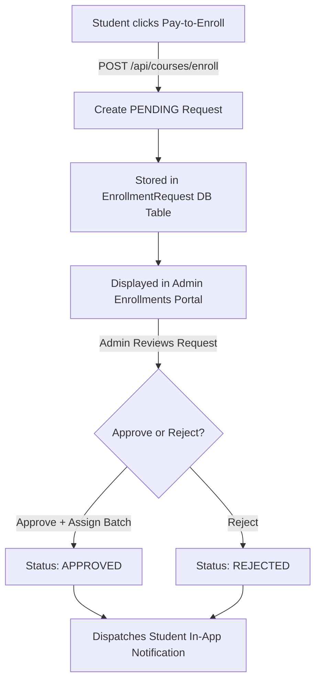

# LMS System Guide & Administrative Workflows

This document serves as the master engineering guide for the enrollment, session scheduling, and UI styling features implemented in the LMS. It outlines the logical workflow, API integration schemas, database models, and operational runbook.

---

## 1. Student Enrollment Workflow

### Pay-to-Enroll Pipeline
The enrollment workflow is divided into three parts:


#### API Specification
* **Create Request:** `POST /api/courses/enroll`
  * **Payload:** `{ "courseId": "cuid" }`
  * **Behavior:** Checks if the student is already enrolled in the course. If not, it creates a new `EnrollmentRequest` with `status: PENDING`.
* **Review/Action Request:** `POST /api/admin/enrollments/:id/approve` or `POST /api/admin/enrollments/:id/reject`
  * **Approve Payload:** `{ "batchId": "cuid" }`
  * **Approve Behavior:** Changes request status to `APPROVED`, links the student directly to the target `Batch`, and logs the approved state.
  * **Notification Dispatch:** Automatically creates an in-app `Notification` warning the student that their enrollment has been approved.

---

## 2. Dynamic User Management (Admin Panel)

Admins can register new users (Students, Instructors, or fellow Admins) directly through the Admin Users UI Modal.

* **Endpoint:** `POST /api/users`
* **Payload:**
  ```json
  {
    "name": "Jane Doe",
    "email": "jane@lms.local",
    "password": "SecurePassword123!",
    "role": "INSTRUCTOR"
  }
  ```
* **Behavior:** Validates email format, hashes the password via `bcryptjs` with 12 rounds, creates the `User` record, and returns the profile without exposing sensitive hashes.

---

## 3. Enhanced Live Session Scheduling

### Custom Meeting URLs & Auto-Teams Scheduler
When scheduling live sessions, admins can choose to either auto-generate a Microsoft Teams link or supply a custom external URL.
1. **Manual URL:** Admins paste an existing meeting URL (e.g. standard Teams, Zoom, or Google Meet link) directly inside the **Custom Join URL (Optional)** input.
2. **Auto Teams Generator:** If the field is left blank, the platform communicates with the Microsoft Graph API, schedules the meeting on the admin's Outlook account, and returns the generated Microsoft Teams join link.

### Instructor Assignment & Dashboard Routing
* **Session Instructor Override:** Admins can override the default batch instructor by selecting a specific instructor for a particular session (using `instructorOverride` inside the POST body).
* **Instructor Dashboard Querying:** The backend `listSessions` service resolves access privileges using an `OR` query, ensuring that overridden session instructors can view and join their assigned sessions directly from their dashboards:
  ```prisma
  where.OR = [
    { instructorId: filters.instructorId },
    { batch: { instructorId: filters.instructorId } }
  ]
  ```

---

## 4. Course Thumbnail Rendering

### Image Mappings
Courses support custom cover images and thumbnail uploads. Uploaded images are mapped to:
* **Local Storage:** `apps/api/uploads/courses/`
* **Static Access URL:** `http://localhost:4000/uploads/courses/<filename>.png`

### Elegant Render Styling (Image vs. Emoji)
To support both legacy mock data (emojis) and uploaded image assets, all four student-facing layouts (`CoursesView`, `HomeView`, `CourseDetailView`, and `BrowseCatalogueView`) use an automatic renderer:
```tsx
<div className="flex h-14 w-14 flex-shrink-0 items-center justify-center rounded-xl border border-border bg-card text-3xl overflow-hidden">
  {course.thumbnail && (course.thumbnail.startsWith("/") || course.thumbnail.startsWith("http")) ? (
    
  ) : (
    course.thumbnail || "📚"
  )}
</div>
```
* **Self-Healing Card Layouts:** This prevents raw URL strings from being printed as text, resolving dashboard overlap bugs completely.

---

## 5. Mock Data Catch Leakage (Resolved)
To ensure reliable database testing, the parallel API calls inside the student portal page (`apps/web/src/app/student/page.tsx`) have been cleaned of catch-block mock values:
* **Old Behavior:** If the backend database was empty, the `.catch(...)` wrappers automatically populated the UI with mock events, mock certificates, and mock mentorship tickets, leading to confusion during database testing.
* **New Behavior:** The `.catch(() => ([]))` fallbacks return clean empty datasets. When mock data is disabled, the platform strictly mirrors the real PostgreSQL database state.

---

## 6. Seed Credentials Index
For quick testing and system logins:

| Role | Email | Password |
|---|---|---|
| **Admin** | `admin@lms.local` | `admin123` |
| **Instructor** | `instructor@lms.local` | `instructor123` |
| **Student** | `student@lms.local` | `student123` |

---
