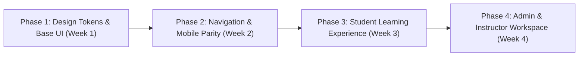

# MarvelSlice LMS — Frontend UI/UX Comprehensive Audit & Modernization Roadmap

> **Audit Date:** September 2026  
> **Target Application:** MarvelSlice LMS (`apps/web`)  
> **Tech Stack:** Next.js 16 (App Router), React 19, Tailwind CSS v4, Tabler Icons, Radix UI Primitives, ApexCharts, Sonner

---

## 1. Executive Summary & Overall Rating

MarvelSlice LMS possesses a **feature-rich, high-utility foundation** with functional portals for Students, Instructors, and Administrators, as well as an integrated course builder, live sessions, and catalogue. 

However, from a **UI/UX design, visual coherence, and frontend architecture** standpoint, the application currently suffers from **design system fragmentation, monolithic God-components, severe mobile navigation gaps in administrative views, and cognitive overload**.

### Overall UI/UX Score: `6.0 / 10`

| Category | Score | Status | Primary Observation |
| :--- | :---: | :---: | :--- |
| **Design System & Visual Tokens** | **5.5 / 10** | ⚠️ Fragmented | 5+ discordant brand blues, conflicting radius scales (6px vs 14px vs 28px). |
| **Student Portal Experience** | **6.8 / 10** | 🟡 Acceptable | Feature-dense, but 1500+ line components and query-param routing cause lag. |
| **Admin & Instructor Experience** | **5.8 / 10** | ⚠️ High Friction | 40+ uncategorized sidebar links; no global search palette (`Cmd+K`). |
| **Mobile Responsiveness** | **4.8 / 10** | 🔴 Critical Issue | Admin sidebar is completely hidden on screens `< 1024px` with no mobile drawer. |
| **Information Architecture (IA)** | **5.2 / 10** | ⚠️ Cluttered | Redundant navigation tiers (e.g. *Content → Content*, *Users → Users*). |
| **Accessibility (WCAG 2.1 AA)** | **5.0 / 10** | ⚠️ Needs Work | Low-contrast muted grays, missing ARIA keyboard navigation, patchy reduced-motion. |
| **Component Architecture & Clean Code** | **4.5 / 10** | 🔴 High Debt | God-components exceeding 2,100 lines; only 4 base UI primitives in `components/ui`. |

---

## 2. In-Depth Audit Findings

### 2.1. Brand Identity & Color Token Fragmentation
- **Blue Palette Collision:**
  - `globals.css`: `--primary: #2551d9`
  - `login/page.tsx`: `#0055FE` (Electric Royal Blue), `#0047BA`, `#3B82F6`
  - `catalogue/page.tsx`: `#175cdd`
  - `admin/dashboard/page.tsx`: `#4F5FE0`
  - Result: The user experiences distinct brand shades depending on whether they are logging in, browsing the catalogue, studying in the student portal, or viewing administrative charts.
- **Secondary Accent Inconsistencies:**
  - Oranges and Ambers range across `--brand-orange: #ea5b1f`, light theme override `#dd6d3d`, login glow `#FF5E14`, and accent `#f59e0b`.
- **Incomplete / Conflicting Dark Mode:**
  - `apps/web/src/app/globals.css` defines dark mode tokens, but then overrides:
    ```css
    [data-theme="dark"] [data-section="admin"] .field {
      background: #ffffff; /* Forces white input fields inside dark theme */
    }
    ```
  - The Course Content view sets its own isolated `[data-sidebar-dark]` attribute with hardcoded `#111111` instead of using standard CSS token variables.

### 2.2. Mobile Responsiveness: Critical Admin Navigation Failure
- In [`AdminSidebar.tsx`](file:///D:/Harish%20Kumar/Project/LMS/apps/web/src/components/AdminSidebar.tsx#L740-L743):
  ```tsx
  <aside className={`fixed left-0 top-14 z-40 hidden ... lg:flex ${collapsed ? "w-16" : "w-64"}`}>
  ```
  The sidebar is set to `hidden` below `lg` (`1024px`).
- In [`Header.tsx`](file:///D:/Harish%20Kumar/Project/LMS/apps/web/src/components/Header.tsx#L125-L131), the hamburger menu button only toggles `collapsed` between `w-16` and `w-64`. Because the sidebar itself has `hidden` for mobile, **administrators and instructors on tablets or phones cannot navigate the LMS at all**.
- Contrast this with the Student Portal, which has a dedicated [`MobileBottomNav.tsx`](file:///D:/Harish%20Kumar/Project/LMS/apps/web/src/components/MobileBottomNav.tsx), highlighting an inconsistent multi-role responsive strategy.

### 2.3. Information Architecture & Cognitive Overload
- **Admin Sidebar Fatigue:**
  - Over 40 links distributed over 10+ vertical groups with duplicate labelling (*Content → Content*, *Users → Users*, *Settings → Settings*).
  - Admins must scroll through high-friction nested dropdowns to find routine operations like "View Students", "Coupons", or "Refunds".
  - Absence of a **Quick Jump / Command Palette (`Cmd + K`)** to search students, courses, or settings instantly.
- **Student Navigation Model:**
  - [`apps/web/src/app/student/page.tsx`](file:///D:/Harish%20Kumar/Project/LMS/apps/web/src/app/student/page.tsx) acts as a monolithic pseudo-SPA switching between 12 distinct subviews via URL search parameters (`?view=courses`, `?view=sessions`).
  - This defeats Next.js App Router benefits (partial route pre-rendering, nested layout caching, bookmarkable deep routes).

### 2.4. Lack of Standard UI Primitives (Design System Deficit)
- Inspecting [`apps/web/src/components/ui`](file:///D:/Harish%20Kumar/Project/LMS/apps/web/src/components/ui) reveals only **4 primitives**:
  1. `ConfirmDialog.tsx`
  2. `SearchInput.tsx`
  3. `Switch.tsx`
  4. `select.tsx`
- **Consequence:**
  - Buttons (`.btn-primary`, `.btn-secondary`, inline Tailwind `px-4 py-2 bg-blue-600...`) are rewritten dozens of times with varying padding, heights, hover transitions, and border radiuses.
  - Modals, Badges, Tabs, Form Inputs, Metric Cards, and Empty States lack unified component interfaces, leading to inconsistent spacing and visual bugs.

### 2.5. Giant God-Components & Maintenance Bottlenecks
- [`CourseContentView.tsx`](file:///D:/Harish%20Kumar/Project/LMS/apps/web/src/app/student/_views/CourseContentView.tsx): **2,115 lines** in a single file combining video playback, quiz runners, note taking, resizing logic, and sticky notes.
- [`HomeView.tsx`](file:///D:/Harish%20Kumar/Project/LMS/apps/web/src/app/student/_views/HomeView.tsx): **1,496 lines** combining hero banners, calendar snapshots, tickets, stats, and course lists.
- [`AdminSidebar.tsx`](file:///D:/Harish%20Kumar/Project/LMS/apps/web/src/components/AdminSidebar.tsx): **759 lines**.
- Monoliths create high re-render cascades, slow HMR (Hot Module Replacement), and discourage code reusability.

---

## 3. UI/UX Modernization Roadmap: "The Way Forward"



### Phase 1: Establish Unified Design System & UI Primitives (Week 1)
*Goal: Fix visual fragmentation and eliminate ad-hoc CSS.*

1. **Standardize Core Design Tokens in Tailwind 4 `@theme`:**
   - **Primary Brand:** Pick one authoritative brand blue (Recommended: `#2551D9` or Modern Royal `#1D4ED8`).
   - **Accent / Energy:** Consistent warm amber (`#F59E0B`) and vivid orange (`#FF5E14`).
   - **Neutral Slate Spectrum:** Standardize on Tailwind Slate or Zinc (`bg-slate-50` light, `bg-slate-900` dark) with uniform borders (`border-slate-200 dark:border-slate-800`).
   - **Uniform Radius Scale:** Settle on `rounded-xl` (12px) for cards, `rounded-lg` (8px) for buttons/inputs.
2. **Build Foundational Component Library in `components/ui/`:**
   - `Button.tsx` (Variants: `primary`, `secondary`, `outline`, `ghost`, `danger`; Sizes: `sm`, `md`, `lg`; Loading state with spinner).
   - `Card.tsx` (Header, Title, Description, Content, Footer).
   - `Badge.tsx` (Status badges: `success`, `warning`, `danger`, `info`, `neutral`).
   - `Input.tsx` & `Textarea.tsx` (Standard focus rings, error labels, helper text).
   - `Modal.tsx` / `Drawer.tsx` (Unified backdrop, escape key handler, focus trap via Radix Dialog).
   - `EmptyState.tsx` (Consistent vector icon/illustration, descriptive title, call-to-action button).
   - `Skeleton.tsx` (Standardized animated pulsing skeletons for cards, tables, and metrics).

---

### Phase 2: Navigation, Mobile Parity & Information Architecture (Week 2)
*Goal: Allow seamless usage on any screen size and eliminate navigation fatigue.*

1. **Fix Admin & Instructor Mobile Navigation:**
   - Replace the desktop-only hidden aside with a **Mobile Drawer / Slide-Over Sheet**.
   - Wire the hamburger toggle in [`Header.tsx`](file:///D:/Harish%20Kumar/Project/LMS/apps/web/src/components/Header.tsx) to open the mobile drawer below `1024px`.
2. **Restructure Admin Information Architecture into 4 Logical Hubs:**
   - **1. Academic & Curriculum:** Courses, Modules, Batches, Live Sessions, Assignment Tracker.
   - **2. People & Mentorship:** Students, Instructors, Interns, Mentorship Tickets.
   - **3. Commercial & Growth:** Packages, Catalogue, Coupons, Referrals, Payments & Refunds.
   - **4. System & Governance:** Audit Logs, Announcements, Cache, Maintenance, API Keys & Settings.
3. **Implement Command Palette (`Cmd + K`):**
   - Provide rapid fuzzy search for courses, batches, students, and settings to eliminate menu hunting.

---

### Phase 3: Student Experience & Learning Polish (Week 3)
*Goal: Maximize student focus, course completion rates, and learning satisfaction.*

1. **Re-engineered Student Dashboard ("Command Center"):**
   - **Hero Bento Grid:**
     - Left: *Continue Learning* card with large thumbnail, last watched timestamp, module title, and one-click "Resume" button.
     - Center: Weekly progress donut + streak tracker.
     - Right: Next upcoming live session countdown with direct "Join Teams" CTA.
   - **Actionable Deadlines Strip:**
     - Compact horizontal cards for pending quizzes and assignments with clear countdown chips (e.g. "Due in 4 hours" in amber).
2. **Modern Course Content Player Layout:**
   - **Theater / Focus Mode:** One-click distraction-free toggle hiding navigation and headers.
   - **Sidebar Tabs:** Clean tab switching between *Course Curriculum*, *Interactive Notes*, and *Study Materials*.
   - **Autoplay & Next Lesson Drawer:** Smooth transition between consecutive lessons and quizzes.

---

### Phase 4: Admin Course Builder & Codebase Health (Week 4)
*Goal: Accelerate administrative workflows and ensure long-term maintainability.*

1. **Course Builder Tab Streamlining:**
   - Visual drag-and-drop or re-orderable item list combining lessons, quizzes, and assignments smoothly.
   - Live video preview modal when entering YouTube or external links.
2. **Decompose Monolithic God-Components:**
   - Split [`CourseContentView.tsx`](file:///D:/Harish%20Kumar/Project/LMS/apps/web/src/app/student/_views/CourseContentView.tsx) into:
     - `CoursePlayerContainer.tsx` (playback & navigation state)
     - `CourseCurriculumSidebar.tsx` (module tree & item completion)
     - `LessonNotePad.tsx` (rich text notes integration)
   - Split [`HomeView.tsx`](file:///D:/Harish%20Kumar/Project/LMS/apps/web/src/app/student/_views/HomeView.tsx) into modular widgets:
     - `ResumeLearningCard.tsx`, `UpcomingSessionsWidget.tsx`, `DeadlinesBanner.tsx`.

---

## 4. Key Takeaways & Recommended Immediate Action

If you want immediate impact with minimal time investment:
1. **Fix Admin Mobile Navigation:** Implement the slide-over drawer so tablet/phone users are not blocked.
2. **Create Core `Button.tsx` and `Card.tsx`:** Standardize the primary buttons and cards across student and admin screens.
3. **Harmonize Brand Blue:** Replace fragmented hex colors with a single CSS custom property `--primary`.
4. **Group Admin Sidebar Items:** Condense the 40+ links into 4 clean categories with unread notification badges.
