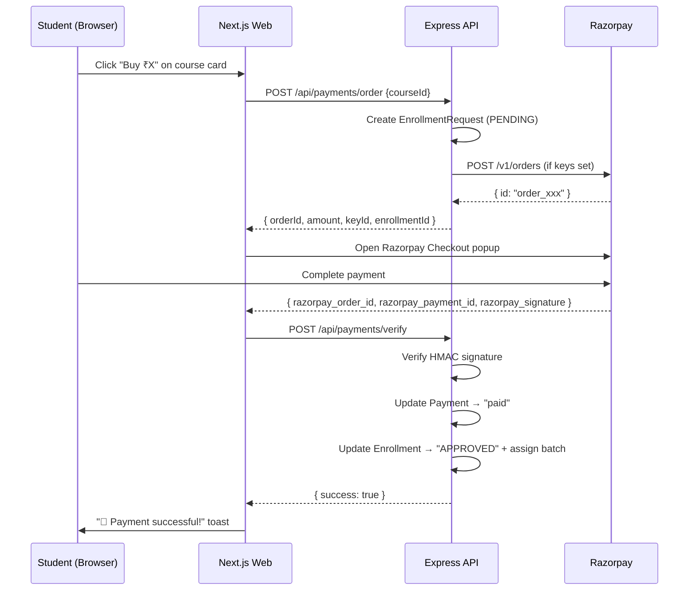

# Razorpay Integration & Unified Login Page

## What was built

### 1. Unified Login Page (`/login`)

The existing login page has been completely redesigned into a premium, animated login/sign-up experience:

- **Sign In / Sign Up tabs** — Users can toggle between login and registration forms
- **3 floating animated blobs** — Smooth CSS float animations (`float-1`, `float-2`, `float-3`) for a living, premium feel
- **Glassmorphic card layout** — Split design with left-side branding and right-side form
- **Instant demo account fill** — Click any demo card to auto-fill email + password
- **Registration flow** — Full sign-up form with password strength validation (8+ chars, uppercase, lowercase, digit)
- **Role-based redirect** — After login: Admin → `/admin/dashboard`, Instructor → `/instructor/dashboard`, Student → `/student/`

### 2. Test Page (`/test-page`)

An exact copy of the login page placed at `/test-page` so **anyone can preview** the UI without it affecting the real login route. Includes a yellow "🧪 Test Page Preview" banner at the top.

### 3. Razorpay Payment API (`/api/payments/*`)

| Endpoint               | Method | Description                                                          |
| ---------------------- | ------ | -------------------------------------------------------------------- |
| `/api/payments/order`  | POST   | Creates a Razorpay order + enrollment request                        |
| `/api/payments/verify` | POST   | Verifies Razorpay signature, marks payment paid, approves enrollment |

**Key design decisions:**

- Uses **direct REST API calls** to Razorpay (no `razorpay` npm package needed — avoids adding deps)
- **Falls back to mock** order IDs when `RAZORPAY_KEY_ID` / `RAZORPAY_KEY_SECRET` are not set
- Signature verification uses `crypto.createHmac` — standard Razorpay approach
- On successful payment, automatically assigns student to the first `ACTIVE`/`UPCOMING` batch

### 4. Course Catalogue Page (`/catalogue`)

A premium, publicly-browsable course catalogue with:

- **Dynamic grid layout** with course cards showing thumbnail, price, curriculum, tags, and "What You'll Learn"
- **Razorpay Checkout integration** — Click "Buy ₹X" → Razorpay popup opens → on success → enrollment approved
- **Search** — Filter courses by title, instructor, or tags
- **Details modal** — Expandable curriculum view
- **Responsive** — Works on mobile and desktop

## Environment Variables

These are already documented in `.env.example`:

```env
# Razorpay (optional — system works in mock mode without these)
RAZORPAY_KEY_ID=rzp_test_xxxxx
RAZORPAY_KEY_SECRET=xxxxx
```

## Files Created/Modified

| File                                              | Action                                         |
| ------------------------------------------------- | ---------------------------------------------- |
| `apps/web/src/app/login/page.tsx`                 | **Rewritten** — Unified login + sign up        |
| `apps/web/src/app/test-page/page.tsx`             | **Created** — Public preview of login page     |
| `apps/web/src/app/catalogue/page.tsx`             | **Created** — Course catalogue with Razorpay   |
| `apps/api/src/modules/payments/payment.routes.ts` | **Created** — Payment order + verify endpoints |
| `apps/api/src/app.ts`                             | **Modified** — Registered `paymentRouter`      |

## Payment Flow


