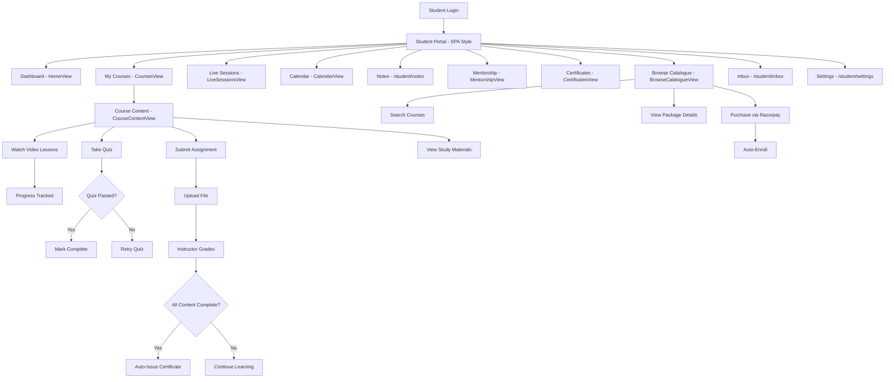
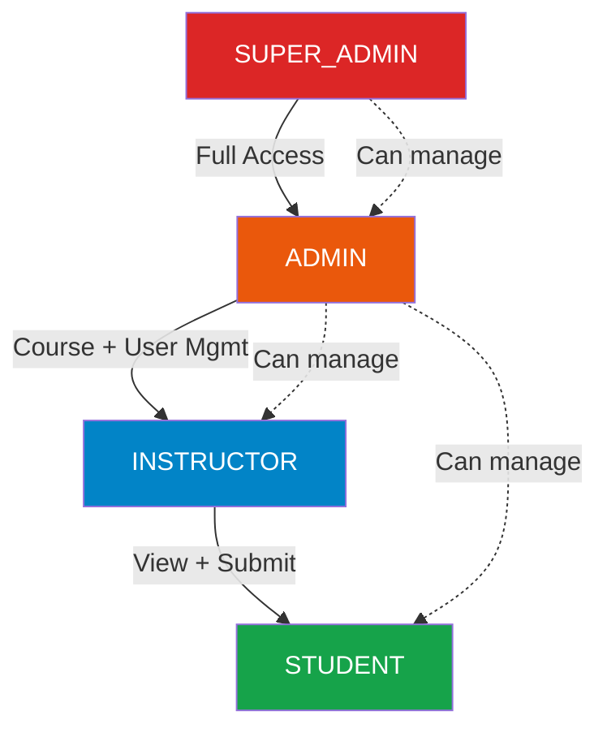
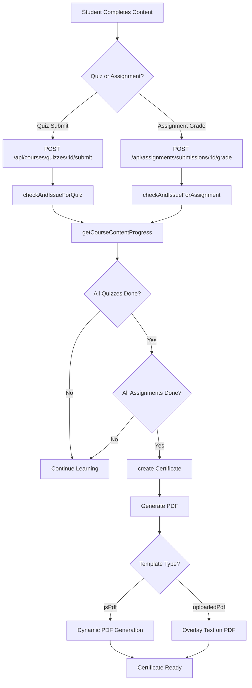

# LMS Workflow Diagrams (Mermaid)

## 1. Login Flow (All Roles)

```mermaid
flowchart TD
    A[User Visits /login] --> B[Enter Email + Password]
    B --> C[POST /api/auth/login]
    C --> D{Login Success?}
    D -->|No| E[Show Error Toast]
    E --> B
    D -->|Yes| F{mustChangePassword?}
    F -->|Yes| G[Redirect to /set-password]
    G --> H[Set New Password]
    H --> I[POST /api/auth/me/set-password]
    I --> J[Redirect to Dashboard by Role]
    F -->|No| J
    J --> K{User Role}
    K -->|STUDENT| L[/student/]
    K -->|INSTRUCTOR| M[/instructor/dashboard]
    K -->|ADMIN| N[/admin/dashboard]
    K -->|SUPER_ADMIN| N
```

---

## 2. Student Flow



---

## 3. Instructor Flow

```mermaid
flowchart TD
    A[Instructor Login] --> B[/instructor/dashboard]
    
    B --> C[Dashboard - Stats Overview]
    B --> D[My Courses - courses/page]
    B --> E[My Batches - batches/page]
    B --> F[Assignments - assignments/page]
    B --> G[Sessions - sessions/page]
    B --> H[Analytics - analytics/page]
    B --> I[Support - support/page]
    B --> J[Mentorship - mentorship/page]
    B --> K[Inbox - inbox/page]
    B --> L[Settings - settings/page]
    
    D --> M[View Course Details]
    M --> N[View Modules]
    M --> O[View Quizzes]
    M --> P[View Assignments]
    
    E --> Q[View Batch Students]
    E --> R[View Attendance]
    
    F --> S[View Submissions]
    S --> T[Grade Assignment]
    T --> U[Enter Grade]
    T --> V[Add Feedback]
    T --> W[View Submitted File]
    
    G --> X[View Live Sessions]
    G --> Y[Join Teams Meeting]
    
    H --> Z[Completion Rates]
    H --> AA[Quiz Scores]
    H --> BB[Video Engagement]
    
    I --> CC[View Support Tickets]
    I --> DD[Reply to Tickets]
```

---

## 4. Admin Flow

```mermaid
flowchart TD
    A[Admin Login] --> B[/admin/dashboard]
    
    B --> C[Dashboard - Overview Stats]
    
    %% Course Management
    B --> D[Courses]
    D --> D1[Create Course]
    D --> D2[Edit Course]
    D --> D3[Add Modules]
    D --> D4[Add Lessons]
    D --> D5[Add Quizzes]
    D --> D6[Add Assignments]
    D --> D7[Upload Study Materials]
    
    %% User Management
    B --> E[Users]
    E --> E1[Create User]
    E --> E2[Edit User]
    E --> E3[Delete User]
    E --> E4[Suspend User]
    E --> E5[Approve Instructor]
    
    %% Batch Management
    B --> F[Batches]
    F --> F1[Create Batch]
    F --> F2[Assign Courses]
    F --> F3[Manage Students]
    
    %% Package Management
    B --> G[Packages]
    G --> G1[Create Package]
    G --> G2[Set Pricing]
    G --> G3[Assign Courses]
    
    %% Financial
    B --> H[Payments]
    B --> I[Coupons]
    B --> J[Enrollments]
    
    %% Content
    B --> K[Categories]
    B --> L[Tags]
    B --> M[Quiz Templates]
    B --> N[Assignment Templates]
    B --> O[Static Pages]
    B --> P[Email Templates]
    B --> Q[Branding]
    
    %% Sessions
    B --> R[Sessions]
    R --> R1[Create Live Session]
    R --> R2[Recordings]
    
    %% Communication
    B --> S[Announcements]
    B --> T[Inbox]
    T --> T1[Notifications]
    T --> T2[Support Tickets]
    T --> T3[Messages]
    
    %% Reports
    B --> U[Reports]
    B --> V[Analytics]
    B --> W[Calendar]
    B --> X[Certificates]
    
    %% System
    B --> Y[Settings]
    B --> Z[Audit Logs]
    B --> AA[Health]
    B --> AB[Cache]
    B --> AC[Trash]
    B --> AD[i18n]
    B --> AE[Microsoft Integration]
    B --> AF[Approvals]
```

---

## 5. Super Admin Flow

```mermaid
flowchart TD
    A[Super Admin Login] --> B[/admin/dashboard]
    
    B --> C[All Admin Features]
    
    %% Super Admin Extras
    B --> D[Super Admin Panel - super-admin/page]
    D --> D1[System Settings]
    D --> D2[Manage Admins]
    D --> D3[System Health]
    D --> D4[Database Backups]
    
    B --> E[Manage Other Admins]
    E --> E1[Create Admin]
    E --> E2[Delete Admin]
    E --> E3[Assign Permissions]
    
    B --> F[System Settings]
    F --> F1[Platform Config]
    F --> F2[Feature Flags]
    F --> F3[API Keys]
    
    B --> G[Audit Logs - Full System]
    B --> H[Cache Management]
    B --> I[System Health Monitor]
    
    C --> J[All Course Management]
    C --> K[All User Management]
    C --> L[All Financial Data]
    C --> M[All Reports]
    C --> N[All System Settings]
```

---

## 6. Permission Hierarchy



---

## 7. Auto-Certificate Flow


